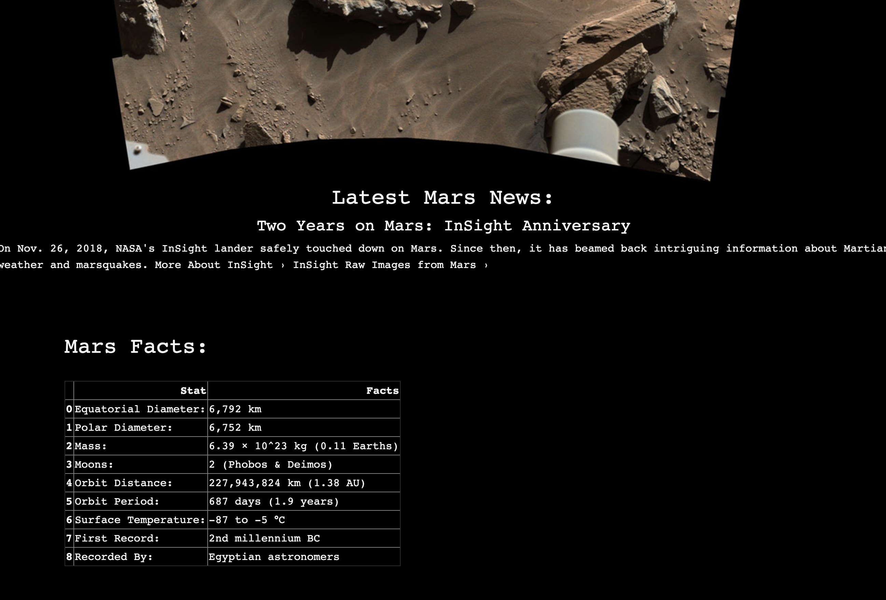

# web-scraping-challenge

- - - - - - - - - - - - - - - - - - - - - - - - - - - - - - - - - - - - - - - - -

## Table of Contents
* [Objectives](#objectives)
* [Step 1](#Step-1)
* [Step 2](#Step-2)
* [Screenshots](#Screenshots)
* [Technologies](#technologies)

## Objectives

In this assignment, I built a web application that scrapes various websites for data related to the Mission to Mars and displays the information in a single HTML page.

## Step 1

### Scraping

Completed initial scraping using Jupyter Notebook, BeautifulSoup, Pandas, and Requests/Splinter. 

[Jupyter Notebook File](Mission_to_Mars/mission_to_mars.ipynb)

## Step 2

### MongoDB and Flask Application

I used MongoDB with Flask templating to create a new HTML page that displays all of the information that was scraped from the URLs above.

*[Scrape route](Mission_to_Mars/scrape_mars.py)

*[Root route](Mission_to_Mars/app.py)

*[HTML file](Mission_to_Mars/templates/index.html)

## Screenshots

## Technologies

Jupyter Notebook

BeautifulSoup

Pandas

Requests/Splinter

MongoDB

HTML

Bootsrap

